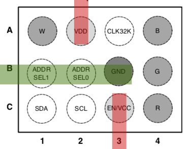
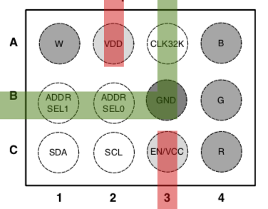
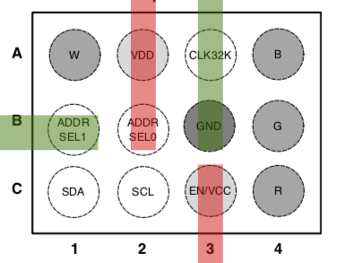
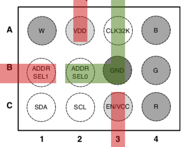
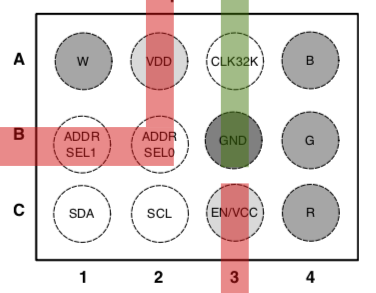
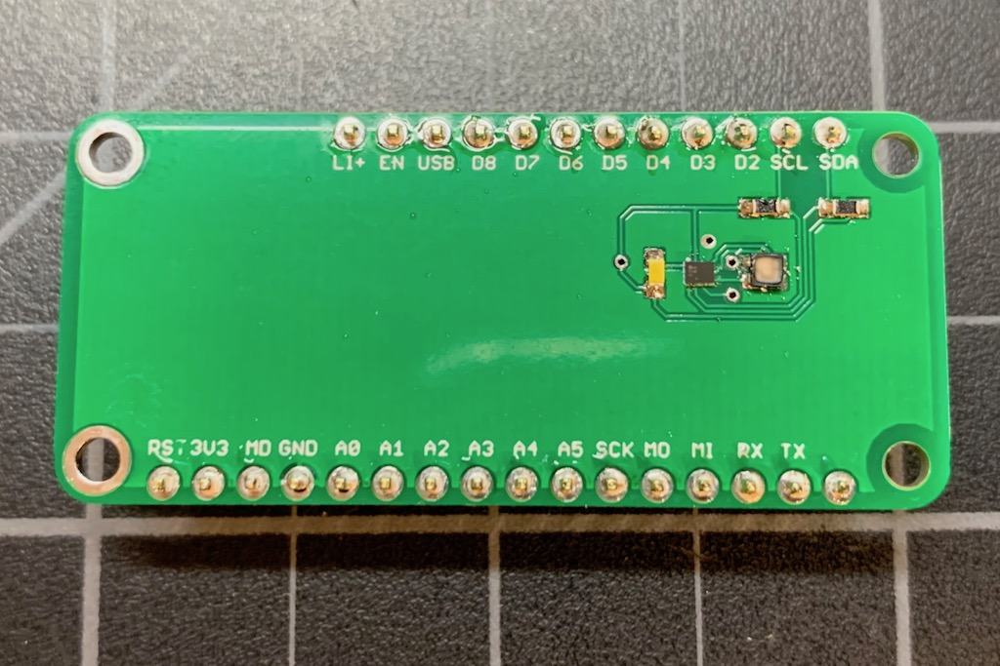
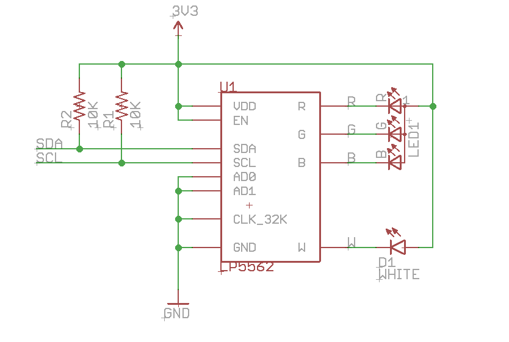
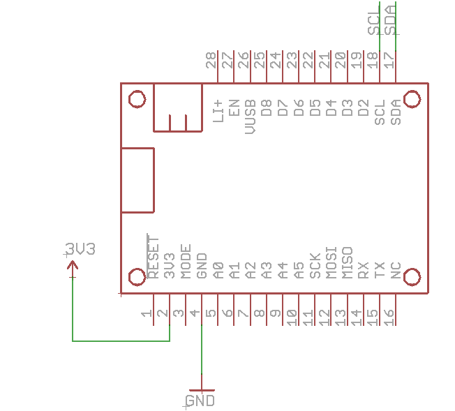
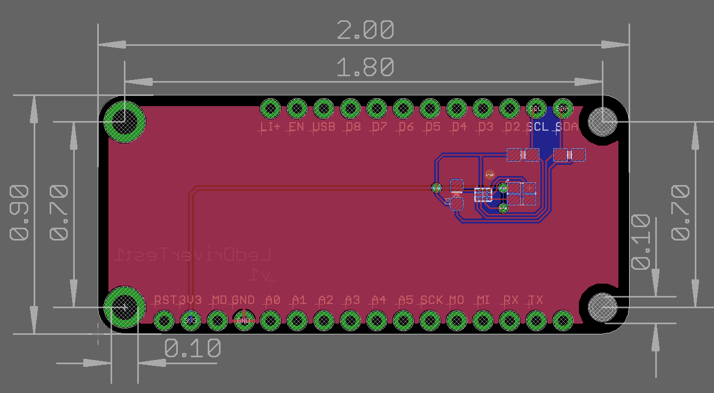
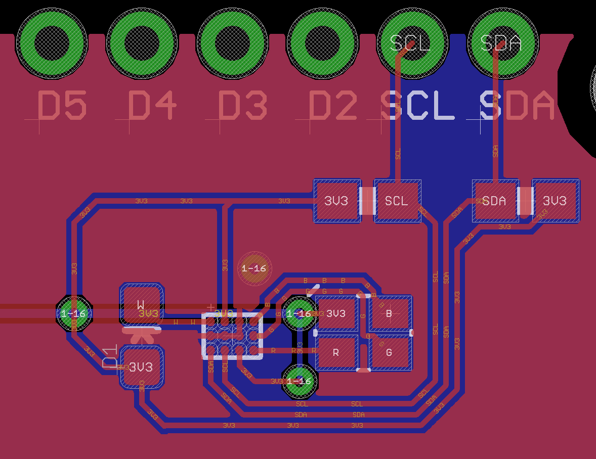

# LP5562-RK

*LP5562 I2C LED Driver for Particle devices*

There are several possibilities for indicator RGB LEDs:

- Direct connection to PWM outputs
- Serial LEDs like NeoPixels (WS2812)
- I2C LED drivers

Direct PWM is the least expensive, but when you are using RGB LEDs you'll quickly run out of available PWM channels. You're pretty much limited to one additional RGB LED on most devices.

NeoPixels are a great option as you can string together dozens of LEDs off a single GPIO. There are a few downsides:

- You need to have 3.6V or higher. You can't run them off 3.3V.
- The NeoPixel library runs for long periods of time with interrupts disabled for long strands, which may affect performance of other code.

The third option is to use an I2C LED driver. That's what this library is for. It allows the use of the TI LP5562 I2C LED driver from a Particle device. Why it this useful?

- It runs at 3.3V
- Uses cheap off-the-shelf RGB LEDs
- You can include up to 4 of them on the I2C bus
- It can drive LEDs up to 25.5 mA, great for large indicator LEDs
- It has a programmable constant current driver so you don't need current limiting resistors
- It's a programmable smart controller so many LED patterns can be made without intervention from the MCU

What's the downside? It does add a chip ($1.14 in single quantities). The biggest challenge is that it's only available in a DSBGA12. This is a really, really tiny 3x4 BGA (ball grid array) chip. 1.648 mm x 1.248 mm. It's barely larger than an 0805 resistor, but with 12 pins. It can only be reflowed; it's obviously not possible to solder with a soldering iron.

On the plus side, you can put one of these on your board and it takes up less space than 3x  0603 current limiting resistors.

While it's designed to drive an RGB LED plus one extra LED (white), it actually can drive any four independent LEDs, though the library is mainly focused on the RGB use case.

### The library

Using the LP5562-RK library is just a matter of adding the library to your project and initializing it:

```
#include "LP5562-RK.h"

LP5562 ledDriver;

void setup() {
	ledDriver.withLEDCurrent(5.0).begin();

	ledDriver.setBreathe(false, true, true, 20, 0, 255);
}

void loop() {
}
```

You normally allocate the object as a global object:

```
LP5562 ledDriver;
```

In setup(), initialize the object. There are some options that you configure fluent-style then call the begin() method:

```
ledDriver.withLEDCurrent(5.0).begin();
```

There are methods to set a constant color, blink, alternating blink, and breathe. This call does cyan breathing:

```
ledDriver.setBreathe(false, true, true, 20, 0, 255);
```

The options left to right are:

- red (disabled)
- green (enabled)
- blue (enabled) (green + blue = cyan)
- 20 the number of half milliseconds per step (10 milliseconds)
- 0 starting brightness 
- 255 ending brightness

[Full browsable API docs](https://rickkas7.github.io/LP5562-RK/index.html) are available. The calls are extensively documented in the .h file. There's also a copy of the HTML docs in the docs subdirectory.

The three example programs illustrate all of the features.

### I2C addressing

The LP5562 has two address select lines to allow you to connect four to a single I2C bus, using address 0x30 to 0x33.

Because of the closeness of the BGA balls if you use the external clock you'll probably be limited to using the single I2C address 0x30. The reason is that you'll probably need to route ground through pins B1 (AD1), B2 (AD0), to B3 (GND).



If you're not using an external clock and using the same power supply for VCC and VDD, then life is much easier, and all addresses are easily routed:

Address 0 (AD1 = 0, AD0 = 0, 0x30):



Address 1 (AD1 = 0, AD0 = 1, 0x31):



Address 2 (AD1 = 1, AD0 = 0, 0x32):



Address 3 (AD1 = 1, AD0 = 1, 0x33):




### Demo Board

I made a simple demo board to test and illustrate the use of the chip. 



Here's the schematic.





And the board. It's an Adafruit Feather form-factor, intended to be used in a double or tripler with a Gen 3 Particle device (Argon, Boron, or Xenon). Male header pins go on the bottom side.



Close-up of the LED circuitry:



The eagle subdirectory contains the open source design:

- LedDriverTest1.sch (schematic)
- LedDriverTest1.brd (board layout)
- LedDriverTest1v1.zip (gerbers)
- LedDriverTest1.lbr (library with all of the components used on the board)


| Quantity | Item | Example | Price |
| --- | --- | --- | ---: |
| 1 | LP5562 | [LP5562TMX/NOPB ](https://www.digikey.com/product-detail/en/texas-instruments/LP5562TMX-NOPB/296-39061-1-ND/5142961) | $1.14 |
| 1 | RGB LED | [Cree CLMVC-FKA-CL1D1L71BB7C3C3](https://www.digikey.com/product-detail/en/cree-inc/CLMVC-FKA-CL1D1L71BB7C3C3/CLMVC-FKA-CL1D1L71BB7C3C3CT-ND/9094273 CLMVC-FKA-CL1D1L71BB7C3C3) | $0.19 |
| 1 | White LED | [Lite-On Inc. LTW-C191DS5](https://www.digikey.com/product-detail/en/lite-on-inc/LTW-C191DS5/160-2239-1-ND/7708913) | $0.55 |
| 2 | 10K Resistor 0603 | [Panasonic ERJ-PA3J103V](https://www.digikey.com/product-detail/en/panasonic-electronic-components/ERJ-PA3J103V/P10KBZCT-ND/5036237) | $0.10 | 
| | Male header pins 0.1" | [Sullins PRPC040SAAN-RC](https://www.digikey.com/product-detail/en/PRPC040SAAN-RC/S1011EC-40-ND/2775214) | |


